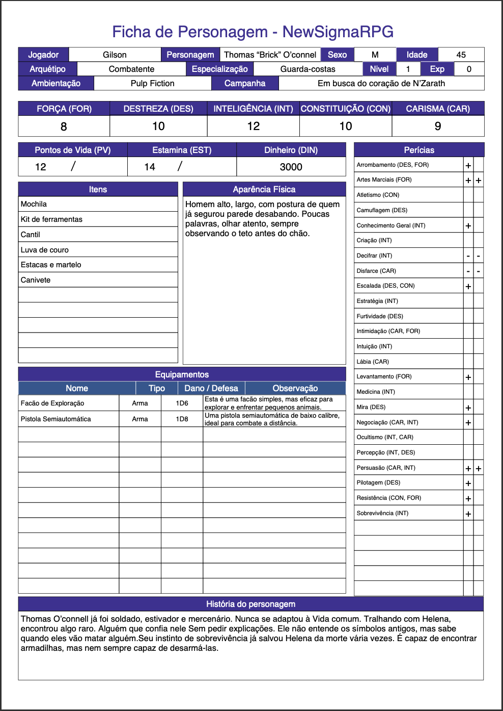

# **Exemplo de Ficha de Personagem**

Um exemplo preenchido ajuda a ilustrar como criar e preencher a ficha de personagem no **NewSigmaRPG**. Aqui está a ficha da **Irmã Ester**, uma freira combatente em um cenário pós-apocalíptico repleto de zumbis.

---

## **Ficha - Thomas "Bricks" O'Connell**

---

## **Detalhamento do Preenchimento**

1. **Jogador e Personagem**:

    - **Jogador**: Manuela Reis.
    - **Personagem**: Thomas "Bricks" O'Connell.
    - **Sexo**: Masculino (M).
    - **Idade**: 45 anos.
    - **Arquétipo**: Combatente.
    - **Especialização**: Guarda-costas.
    - **Nível**: 1.
    - **EXP**: 0.

2. **Atributos**:

    - **FOR (Força)**: 8.
    - **DES (Destreza)**: 10.
    - **INT (Inteligência)**: 12.
    - **CON (Constituição)**: 10.
    - **CAR (Carisma)**: 9.

3. **Pontos de Vida, Estamina e Dinheiro**:

    - **PV**: 12.
    - **Estamina**: 14.
    - **Dinheiro**: 3000 unidades (interpretadas pelo mestre como adequadas à ambientação).

4. **Perícias**:

    - Marcadas com **+**: Arrombamento, Artes Marciais, Conhecimento Geral, Escalada, Levantamento, Mira, Negociação, Persuasão, Pilotagem, Resistência, Sobrevivência.
    - Marcadas com **-**: Decifrar, Disfarce.
    - Outras perícias não possuem modificadores.

5. **Itens**:

    - Mochila.
    - Kit de Ferramentas.
    - Cantil.
    - Luva de couro.
    - Estacas e Martelo.
    - Canivete

6. **Equipamentos**:

   - **Facão de exploraração**:
     - **Tipo**: ATA.
     - **Dano/Defesa**: 1D6.
     - **Observação**: Esta é uma facão simples, mas eficaz para explorar e enfrentar pequenos animais.
   - **Pistola Semiautomática.**:
     - **Tipo**: ATA.
     - **Dano/Defesa**: 1D8.
     - **Observação**: Uma pistola semiautomática de baixo calibre, ideal para combate a distância.

7. **Aparência Física**:

   - **Descrição**:
       - Homem alto, largo, com postura de quem já segurou parede desabando. Poucas palavras, olhar atento, sempre observando o teto antes do chão.

8. **História do Personagem**:

    - **Resumo**:
        - Thomas O’connell já foi soldado, estivador e mercenário. Nunca se adaptou à Vida comum. Tralhando com Helena, encontrou algo raro. Alguém que confia nele Sem pedir explicações. Ele não entende os símbolos antigos, mas sabe quando eles vão matar alguém.Seu instinto de sobrevivência já salvou Helena da morte vária vezes. É capaz de encontrar armadilhas, mas nem sempre capaz de desarmá-las.

---

### **Dicas para Mestres e Jogadores**

- Este exemplo demonstra como preencher a ficha de personagem de forma completa e detalhada, adaptando os elementos à ambientação.
- A ficha do Thomas O'Connell pode servir como referência para outros personagens combatentes.
- Incentive os jogadores a adicionar detalhes narrativos que reforcem a conexão entre o personagem e o cenário.

---

Este exemplo oferece uma base sólida para criar personagens únicos e adaptados a qualquer ambientação no **NewSigmaRPG**.
