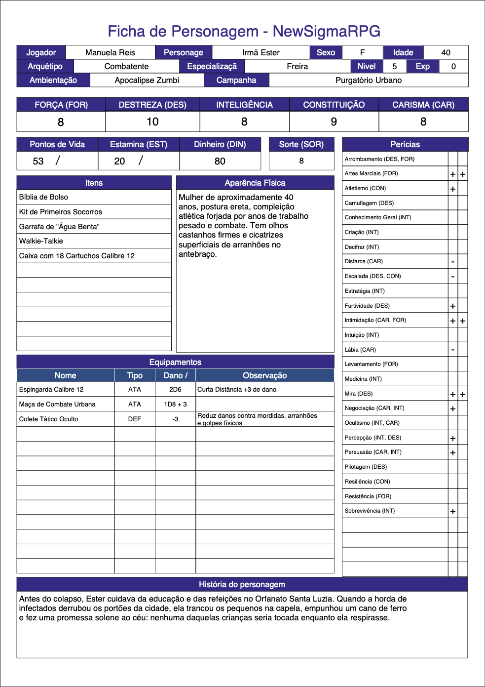

# **Exemplo de Ficha de Personagem**

Um exemplo preenchido ajuda a ilustrar como criar e preencher a ficha de personagem no **NewSigmaRPG**. Abaixo está a ficha oficial da **Irmã Ester**, uma freira combatente em um cenário pós-apocalíptico repleto de zumbis.

---

## **Ficha — Irmã Ester**

---

## **Detalhamento do Preenchimento**

1. **Jogador e Personagem**:
    - **Jogador**: Manuela Reis.
    - **Personagem**: Irmã Ester.
    - **Sexo**: Feminino (F).
    - **Idade**: 40 anos.
    - **Arquétipo**: Combatente.
    - **Especialização**: Freira Combatente.
    - **Nível**: 5 (personagem em campanha contínua).
    - **EXP**: 0.
    - **Ambientação**: Apocalipse Zumbi.
    - **Campanha**: Purgatório Urbano.

2. **Atributos**:
    - **FOR (Força)**: 8 (Intervalo base: 6 a 10).
    - **DES (Destreza)**: 10 (Intervalo base: 8 a 12).
    - **INT (Inteligência)**: 8 (Intervalo base: 6 a 10).
    - **CON (Constituição)**: 9 (Intervalo base: 7 a 11).
    - **CAR (Carisma)**: 8 (Intervalo base: 6 a 10).
    - **SOR (Sorte)**: 8 (Intervalo base: 6 a 10).

3. **Pontos de Vida, Estamina e Dinheiro**:
    - **Pontos de Vida (PV)**: 53 (acumulados através de sua base de Combatente e sua progressão heroica até o Nível 5).
    - **Estamina (EST)**: 20 (sua energia para manobras de combate e resistência).
    - **Dinheiro (DIN)**: 80 unidades (recursos acumulados na ambientação para escambo e suprimentos).

4. **Perícias**:
    - **Pacote Vocacional de Combatente**:
        - **Artes Marciais (+2)**: Marcada com `+ +` (Maestria nata em combate corpo a corpo).
        - **Atletismo (+1)**: Marcada com `+` (Vigor físico e corrida).
        - **Lábia (-1)**: Marcada com `-` (Fraqueza temática: direta, honesta e avessa a mentiras).
    - **Perícias Adicionais Treinadas (+)**:
        - **Intimidação (+2)**: Marcada com `+ +`.
        - **Mira (+2)**: Marcada com `+ +`.
        - **Furtividade (+1)**: Marcada com `+`.
        - **Negociação (+1)**: Marcada com `+`.
        - **Percepção (+1)**: Marcada com `+`.
        - **Persuasão (+1)**: Marcada com `+`.
        - **Sobrevivência (+1)**: Marcada com `+`.
    - **Penalidades Voluntárias (-)**:
        - **Disfarce (-1)**: Marcada com `-`.
        - **Escalada (-1)**: Marcada com `-`.

5. **Itens**:
    - Bíblia de Bolso.
    - Kit de Primeiros Socorros.
    - Garrafa de "Água Benta".
    - Walkie-Talkie.
    - Caixa com 18 Cartuchos Calibre 12.

6. **Equipamentos**:
    - **Espingarda Calibre 12**:
        - **Tipo**: ATA (Arma / Ataque).
        - **Dano/Defesa**: 2D6.
        - **Observação**: Curta Distância +3 de dano.
    - **Maça de Combate Urbana**:
        - **Tipo**: ATA (Arma / Ataque).
        - **Dano/Defesa**: 1D8 + 3.
        - **Observação**: Arma contundente improvisada contra infectados.
    - **Colete Tático Oculto**:
        - **Tipo**: DEF (Defesa / Armadura).
        - **Dano/Defesa**: -3 de dano recebido (Redução de Dano 3).
        - **Observação**: Reduz danos contra mordidas, arranhões e golpes físicos.

7. **Aparência Física**:
    - Mulher de aproximadamente 40 anos, postura ereta, compleição atlética forjada por anos de trabalho pesado e combate. Tem olhos castanhos firmes e cicatrizes superficiais de arranhões no antebraço.

8. **História da Personagem**:
    - Antes do colapso, Ester cuidava da educação e das refeições no Orfanato Santa Luzia. Quando a horda de infectados derrubou os portões da cidade, ela trancou os pequenos na capela, empunhou um cano de ferro e fez uma promessa solene ao céu: nenhuma daquelas crianças seria tocada enquanto ela respirasse.

---

### **Dicas para Mestres e Jogadores**

- Este exemplo demonstra como preencher a ficha de personagem de forma completa e detalhada, adaptando os elementos à ambientação.
- A ficha da Irmã Ester serve como excelente referência para personagens que já evoluíram durante a crônica e enfrentam cenários hostis.
- Incentive os jogadores a adicionar detalhes visuais e narrativos que reforcem a conexão entre o protagonista e o cenário.

---

Este exemplo oferece uma base sólida para criar personagens únicos e adaptados a qualquer ambientação no **NewSigmaRPG**.
