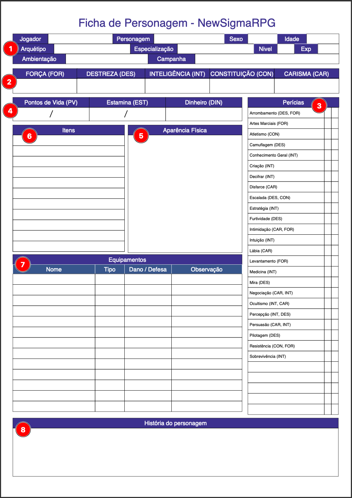

# **Preenchendo a Ficha**

Abaixo está a ficha de personagem do **NewSigmaRPG**, numerada para facilitar o preenchimento. Cada área corresponde a uma parte importante da criação e desenvolvimento do personagem.

---

## **1. Identificação do Personagem**

- **Descrição**: Nesta seção, o jogador preenche as informações básicas do personagem.
  - **Jogador**: Nome do jogador responsável pelo personagem.
  - **Personagem**: Nome do personagem.
  - **Sexo**: Gênero do personagem (opcional).
  - **Idade**: Idade do personagem.
  - **Arquetipo**: Escolha o arquétipo do personagem. [Saiba mais sobre arquétipos](../arquetipos/o-que-sao-arquetipos.md).
  - **Especialização**: Defina a especialidade do personagem com base na ambientação. [Leia sobre especialidades](../criando-personagem/introducao.md#especialidades).
  - **Ambientação**: Insira a ambientação específica da campanha, como medieval, cyberpunk ou pós-apocalíptico. [Saiba mais sobre ambientação](../../ambientacao.md)
  - **Campanha**: Nome da campanha na qual o personagem está inserido.
  - **Nível e EXP**: Insira o nível atual do personagem e a experiência acumulada.

---

## **2. Atributos**

- **Descrição**: Preencha os valores iniciais dos atributos com base nas regras de criação de personagem. Esses valores determinam as capacidades básicas do personagem.
  - **Força (FOR)**: Representa poder físico e capacidade de levantar peso.
  - **Destreza (DES)**: Mede agilidade, reflexos e coordenação.
  - **Inteligência (INT)**: Refere-se à capacidade de raciocínio, aprendizado e conhecimento.
  - **Constituição (CON)**: Indica resistência física e capacidade de suportar danos.
  - **Carisma (CAR)**: Reflete habilidades sociais, charme e persuasão.

[Saiba mais sobre Atributos](../criando-personagem/definicao-atributos.md).

---

## **3. Perícias**

- **Descrição**: Marque as perícias disponíveis para o personagem com **"+"** (habilidade positiva) ou **"-"** (habilidade negativa), conforme os pontos disponíveis na criação da ficha.
  - Cada perícia está associada a um ou mais atributos relevantes.
  - Há espaço para adicionar perícias personalizadas, se necessário.

[Leia mais sobre Perícias](../criando-personagem/escolha-pericias.md).

---

## **4. Pontos de Vida (PV), Estamina (EST) e Dinheiro (DIN)**

- **Descrição**: Registre os valores iniciais de pontos de vida, estamina e dinheiro:
  - **Pontos de Vida (PV)**: Representam a capacidade do personagem de suportar dano antes de ser incapacitado.
  - **Estamina (EST)**: Usada para ativar habilidades, magias ou usar equipamentos especiais.
  - **Dinheiro (DIN)**: Representa os recursos financeiros disponíveis, cuja moeda é definida pela ambientação.

[Saiba mais sobre Pontos de Vida, Estamina e Dinheiro](../pontos-vida-estamina.md).

---

## **5. Aparência Física**

- **Descrição**: Escreva uma descrição detalhada da aparência física do personagem, incluindo traços marcantes, vestuário, ou outros elementos visuais.

---

## **6. Itens**

- **Descrição**: Liste itens simples ou utilitários que o personagem carrega.
  - **Exemplos**: Cordas, tochas, cartas, microchips, poções ou qualquer outro objeto que não seja considerado um equipamento.
  - Use este campo para registrar itens de missão, ferramentas básicas ou consumíveis.

[Leia mais sobre Itens e Equipamentos](itens-equipamentos.md).

---

## **7. Equipamentos**

- **Descrição**: Organize os equipamentos utilizados pelo personagem, detalhando suas funções e características específicas.
  - **Nome**: Identifique o equipamento.
  - **Tipo**: Classifique o equipamento (exemplo: arma, armadura, ferramenta avançada).
  - **Dano/Defesa**: Indique o dano causado ou a defesa oferecida pelo equipamento.
  - **Observação**: Detalhes adicionais sobre o equipamento, como durabilidade ou características únicas.

[Leia mais sobre Itens e Equipamentos](itens-equipamentos.md).

---

## **8. História do Personagem**

- **Descrição**: Insira um resumo do background do personagem, incluindo origem, motivações, e eventos importantes de sua vida.
  - Ajuda a conectar o personagem com a narrativa e criar momentos significativos durante o jogo.

[Saiba mais sobre Background](background.md).

---
