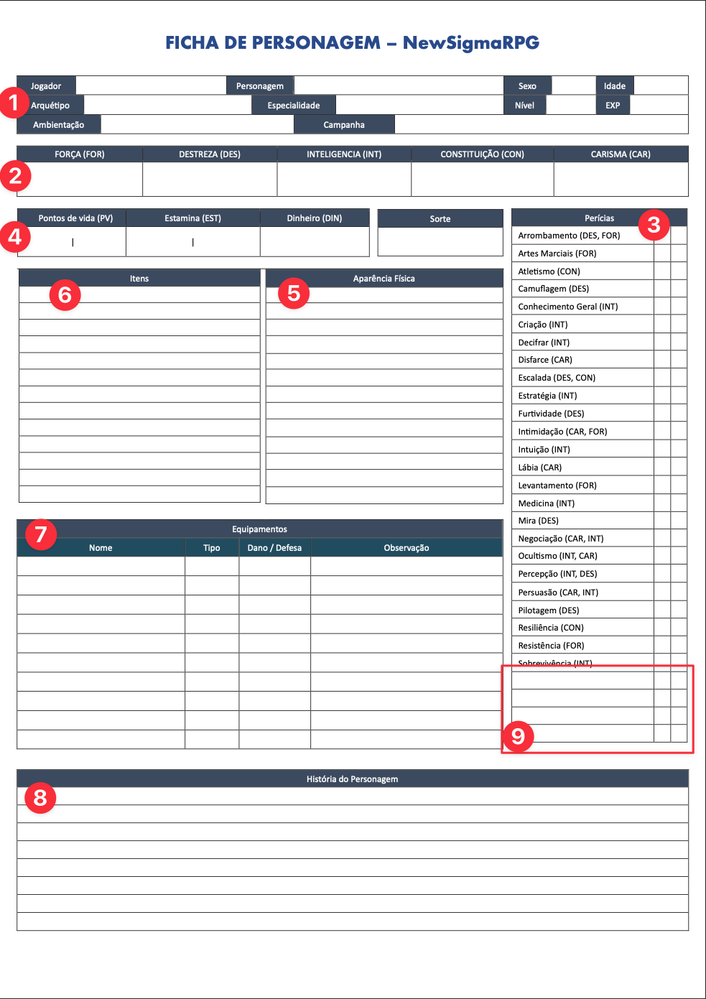

# **Preenchendo a Ficha**

Abaixo está a ficha de personagem do **NewSigmaRPG**, numerada para facilitar o preenchimento. Cada área corresponde a uma parte importante da criação e desenvolvimento do personagem.

---

## **1. Identificação do Personagem**

- **Descrição**: Nesta seção, o jogador preenche as informações básicas e de ambientação do personagem:
  - **Jogador**: Nome do jogador responsável pelo personagem.
  - **Personagem**: Nome do personagem dentro da narrativa.
  - **Sexo**: Gênero do personagem (opcional).
  - **Idade**: Idade cronológica ou aparente do personagem.
  - **Arquétipo**: O modelo conceitual escolhido (Combatente, Especialista, Ladino, Conjurador, Guardião ou Suporte). [Saiba mais sobre arquétipos](../arquetipos/o-que-sao-arquetipos.md).
  - **Especialidade**: O foco prático ou ocupação do personagem adaptada à ambientação (ex: *Atiradora de Elite*, *Médico de Campo*, *Hacker*, *Ferreiro Rúnico*). [Leia sobre especialidades](../criando-personagem/introducao.md#escolhendo-uma-especialidade).
  - **Ambientação**: O universo da campanha (ex: Fantasia Medieval, Cyberpunk, Pós-Apocalíptico, Sci-Fi ou Velho Oeste). [Saiba mais sobre ambientação](../../ambientacao.md).
  - **Campanha**: Nome da campanha ou crônica em andamento.
  - **Nível e EXP**: Nível atual do personagem (iniciando em 1) e pontos de experiência acumulados.

---

## **2. Atributos Principais**

- **Descrição**: Valores numéricos (escala padrão de 8 a 12 na criação) que representam a base biológica e mental do personagem:
  - **Força (FOR)**: Potência muscular, capacidade de carga e dano em ataques corporais.
  - **Destreza (DES)**: Agilidade motora, equilíbrio, reflexos e precisão.
  - **Inteligência (INT)**: Raciocínio lógico, memória, percepção analítica e conhecimento teórico.
  - **Constituição (CON)**: Resistência física, vigor biológico, tolerância a venenos e saúde.
  - **Carisma (CAR)**: Presença social, liderança, empatia, persuasão e charme.

[Saiba mais sobre Atributos](../criando-personagem/definicao-atributos.md).

---

## **3. Perícias Padrão**

- **Descrição**: Lista com as 24 perícias oficiais do sistema. Cada perícia possui caixas duplas de preenchimento para marcar **"+"** (habilidade positiva / expansão de intervalo) ou **"-"** (habilidade negativa / contração de intervalo):
  - Definidas a partir do **Pacote Vocacional** do arquétipo (+2 na perícia primária, +1 na secundária, -1 na falha vocacional) somadas aos **3 pontos livres** de criação.
  - O modificador final de cada perícia varia de **-2 a +2**, onde cada ponto expande ou contrai o intervalo do teste em ±1.
  - Cada perícia é associada aos atributos mais relevantes na hora da rolagem.

[Leia mais sobre Perícias](../criando-personagem/escolha-pericias.md) e [Lista Completa de Perícias](../../regras-basicas/atributos-e-pericias/pericias.md).

---

## **4. Pontos de Vida (PV), Estamina (EST), Sorte (SOR) e Dinheiro (DIN)**

- **Descrição**: Registro dos medidores de sobrevivência, esforço, incerteza e recursos materiais:
  - **Pontos de Vida (PV)**: Calculados inicialmente como `CON × 2` (ou conforme regras de arquétipo). Indicam o dano que o corpo suporta antes de cair em estado de Agonia (0 PV).
  - **Estamina (EST)**: Calculada inicialmente como `CON + INT` (ou conforme arquétipo). É a reserva de energia utilizada para manobras de combate, esquivas, bloqueios e habilidades especiais.
  - **Sorte (SOR)**: Atributo narrativo de incerteza favorável ("Gato de Schrödinger"). Seu valor padrão é **8** (podendo ser ajustado pelo Mestre). Quando testado, rola-se 2D8 buscando obter um resultado dentro do intervalo simétrico `[Sorte - 2, Sorte + 2]` (ou seja, de 6 a 10 para Sorte 8). [Saiba mais sobre a Sorte](../../regras-basicas/atributos-e-pericias/sorte.md).
  - **Dinheiro (DIN)**: Recursos financeiros disponíveis para compras e serviços, cuja moeda é determinada pela ambientação (ouro, créditos, tampinhas, etc.).

[Saiba mais sobre Pontos de Vida, Estamina e Dinheiro](../pontos-vida-estamina.md).

---

## **5. Aparência Física**

- **Descrição**: Espaço dedicado para anotar os traços visuais marcantes do personagem:
  - Altura, peso aparente, porte físico, cicatrizes, tatuagens, vestimentas características ou acessórios emblemáticos.

---

## **6. Itens (Inventário / Mochila)**

- **Descrição**: Lista de itens utilitários, ferramentas cotidianas, consumíveis e provisões carregadas pelo personagem:
  - **Exemplos**: Cordas, cantis, kits de primeiros socorros, gazuas, tochas, baterias, comunicadores ou itens de missão.

[Leia mais sobre Itens e Equipamentos](itens-equipamentos.md).

---

## **7. Equipamentos (Armas, Armaduras e Proteções)**

- **Descrição**: Tabela técnica detalhando o arsenal bélico e equipamentos defensivos prontamente empunhados ou vestidos:
  - **Nome**: Identificação da arma, armadura ou escudo.
  - **Tipo**: Classificação funcional (Arma Branca Leve/Pesada, Fogo Curto/Longo, Armadura Leve/Pesada, etc.).
  - **Dano / Defesa**: Quantidade de dano bruto causado ou índice de proteção/absorção fornecido.
  - **Observação**: Alcance, recarga, propriedades especiais (ex: penetrante, automática, pesada).

[Leia mais sobre Itens e Equipamentos](itens-equipamentos.md).

---

## **8. História do Personagem (Background)**

- **Descrição**: Resumo compacto do histórico de vida, origens, motivações, vínculos afetivos ou traumas que moldaram o personagem:
  - Fornece ganchos imediatos para o Mestre integrar o personagem à narrativa e aos desafios da crônica.

[Saiba mais sobre Background](background.md).

---

## **9. Perícias Customizadas por Ambientação**

- **Descrição**: Na parte inferior da tabela de perícias, há **linhas em branco** com caixas de marcação dedicadas para que o Mestre e os jogadores incluam **perícias exclusivas do cenário** da campanha:
  - Permite contemplar conhecimentos tecnológicos, místicos ou específicos que não existem no mundo comum.
  - **Exemplos por Ambientação**:
    - **Cyberpunk / Sci-Fi**: *Hackear*, *Astro-Navegação*, *Cibernética*.
    - **Fantasia Medieval**: *Arcanismo*, *Alquimia / Herbalismo*, *Adestramento*.
    - **Velho Oeste**: *Saque Rápido*, *Rastreamento*, *Jogatina*.
    - **Investigação Noir / Horror**: *Ciência Forense*, *Contatos do Submundo*, *Ocultismo Proibido*.
  - Seguem rigorosamente as mesmas regras das perícias padrão: são vinculadas a um atributo relevante e podem receber modificadores de **-2 a +2**.

[Saiba mais sobre Perícias Customizadas por Ambientação](../../regras-basicas/atributos-e-pericias/pericias.md#pericias-customizadas-por-ambientacao).

---
